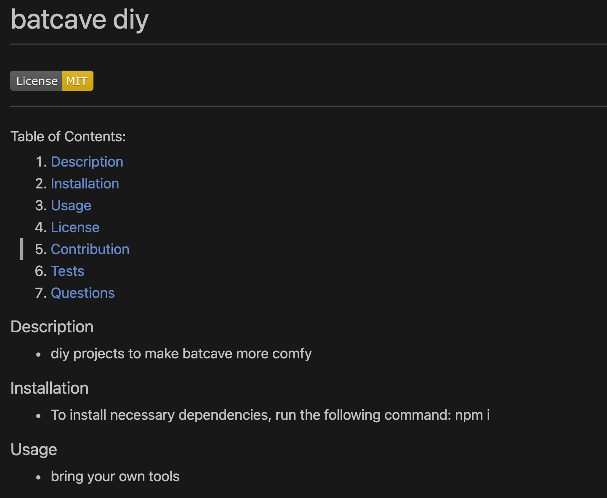

# batcave diy

# 

#### Table of Contents:

1. [Description](#description)
2. [Installation](#installation)
3. [Usage](#usage)
4. [License](#license)
5. [Contribution](#contribution)
6. [Tests](#tests)
7. [Questions](#questions)

### Description

- diy projects to make batcave more comfy

### Installation

- To install necessary dependencies, run the following command: npm i

### Usage

- bring your own tools

### License

- This project is licensed under the License
  [MIT](https://choosealicense.com/licenses/mit/)

### Contribution

- undefined

### Tests

- To run test, run the following command: npm test

### Questions

- If you have any questions about the rep, open an issue or contact me directly at <abatman@gmail.com></a>
- You can find more of my work on Github [batman](http://github.com/batman)

### Screenshots and Link to Video

Link: 

https://drive.google.com/file/d/1pr6lIrCmy6QCAAU0Z17kItBEYNZOwe12/view 

